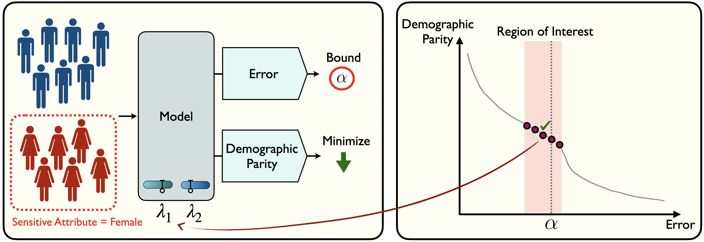

# Risk-Controlling Model Selection via Guided Bayesian Optimization

Code for [Risk-Controlling Model Selection via Guided Bayesian Optimization](https://openreview.net/forum?id=nvmGBcElus) 

## Summary

Adjustable hyperparameters of machine learning models typically impact various key trade-offs such as accuracy, fairness, robustness, or inference cost. Our goal in this paper is to find a configuration that adheres to user-specified limits on certain risks while being useful with respect to other conflicting metrics. We solve this by combining Bayesian Optimization (BO) with rigorous risk-controlling procedures, where our core idea is to steer BO towards an efficient testing strategy. Our BO method identifies a set of Pareto optimal configurations residing in a designated region of interest. The resulting candidates are statistically verified and the best-performing configuration is selected with guaranteed risk levels. We demonstrate the effectiveness of our approach on a range of tasks with multiple desiderata, including low error rates, equitable predictions, handling spurious correlations, managing rate and distortion in generative models, and reducing computational costs. 


### Prerequisites

* pytorch
* numpy 
* pandas
* seaborn
* scipy
* smac
* pymoo
* openbox

### Usage

1. Dowload Adult dataset and change the path in fairness/datast.py
2. Run:

    python run.py --tasks fairness --seeds 0


### Citation
If you use this in your work please cite:
```bibtex
@article{{laufer2024risk,
    title={Risk-Controlling Model Selection via Guided Bayesian Optimization},
    author={Bracha Laufer-Goldshtein and Adam Fisch and Regina Barzilay and Tommi Jaakkola},
    journal={Transactions on Machine Learning Research},
    year={2024},
}
